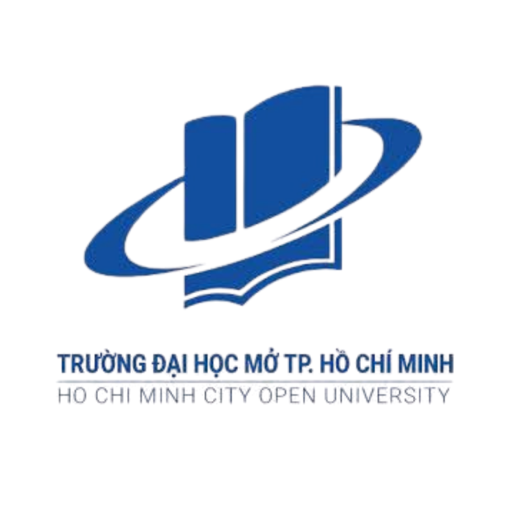

# OU-SSH: Hệ Thống Quản Lý Kết Quả Học Tập - Rèn Luyện & Tự Động Hóa Xét Duyệt Học Bổng

<p align="center">
  
</p>

> **ĐỀ TÀI ĐỒ ÁN TỐT NGHIỆP ĐẠI HỌC**  
> **Sinh viên thực hiện**: NGUYỄN THỊ TUYẾT TRINH (MSSV: `2351010216`)  
> **Giảng viên hướng dẫn**: Th.S NGUYỄN TRUNG HẬU  
> **Đơn vị đào tạo**: Trường Đại học Mở Thành phố Hồ Chí Minh (OU)

---

## 📌 1. Giới thiệu Đề tài
**OU-SSH (Open University Student Success Hub)** là hệ thống quản lý học vụ và hỗ trợ sinh viên thế hệ mới, giải quyết trọn vẹn bài toán theo dõi kết quả học tập (GPA), điểm rèn luyện (ĐRL), tiếp nhận minh chứng, xử lý kiến nghị và **tự động hóa toàn diện quy trình xét duyệt Học bổng Khuyến khích học tập (HB KKHT)** dựa trên **Dynamic Rule Engine & Versioning**.

Hệ thống hỗ trợ 2 mô hình trải nghiệm:
1. **Cổng Web Quản trị Thymeleaf (SSR)**: Dành cho công tác quản trị và báo cáo nhanh (`http://localhost:8080/web/login`).
2. **Cổng Ứng dụng Single Page App (ReactJS + Tailwind CSS)**: Giao diện trực quan, hiện đại, mượt mà cho cả 4 vai trò (`http://localhost:8000`).

---

## 🏛️ 2. Quy Chế & Thuật Toán Xét Học Bổng Khuyến Khích Học Tập (OU)

Hệ thống được thiết kế bám sát chặt chẽ theo **Quy chế Học bổng Khuyến khích Học tập của Trường Đại học Mở TP.HCM**:

### ⏳ Thời gian & Điều kiện Xét duyệt:
- Được xét và cấp theo **từng học kỳ của năm học**, ngay sau khi có đầy đủ điểm học phần và điểm rèn luyện của học kỳ đó.
- **Điều kiện cần**:
  1. Không có môn nào bị nợ / rớt trong học kỳ (`coHocPhanRot = false`).
  2. Tích lũy đủ số tín chỉ tối thiểu theo quy định (mặc định $\ge 14$ tín chỉ).
  3. Điểm học tập và rèn luyện đạt ngưỡng tối thiểu: $\text{GPA} \ge 2.50$ và $\text{ĐRL} \ge 65$.

### 💰 Quỹ Học Bổng & Mức Chi Trả (% Học phí):
- **Quỹ Học bổng**: Được trích lập **tối thiểu 8% trên tổng thu học phí** của sinh viên trong học kỳ đó, sau đó phân bổ ngân sách cho từng Khoa/Ngành (`nganSachKhoa`).
- **Mức Học Bổng theo Tỷ Lệ % Học Phí Bình Quân**:
  | Phân Loại Học Bổng | Tiêu Chuẩn GPA & ĐRL | Tỷ Lệ Chi Trả (% Học phí) | Mức Mẫu (Chương trình Đại trà) |
  | :--- | :--- | :---: | :---: |
  | 🌟 **Xuất sắc** | $\text{GPA} \ge 3.60$ & $\text{ĐRL} \ge 90$ | **100% Học phí** | `10.000.000 VNĐ` |
  | 🥇 **Giỏi** | $\text{GPA} \ge 3.20$ & $\text{ĐRL} \ge 80$ | **70% Học phí** | `7.000.000 VNĐ` |
  | 🥈 **Khá** | $\text{GPA} \ge 2.50$ & $\text{ĐRL} \ge 65$ | **50% Học phí** | `5.000.000 VNĐ` |

*(Chương trình Đào tạo Đặc biệt / CLC áp dụng mức học phí theo hệ số riêng của trường).*

### 📊 Cơ Chế Xếp Hạng & Cấp Ngân Sách "Lấy Từ Trên Xuống Đến Khi Hết Quỹ":
1. **Xếp hạng ưu tiên**: $\text{GPA cao hơn} \rightarrow \text{ĐRL cao hơn} \rightarrow \text{Số tín chỉ nhiều hơn}$.
2. **Cấp phát quỹ từ trên xuống**: Cấp học bổng cho sinh viên xếp hạng 1, 2, 3... và trừ trực tiếp vào Quỹ ngân sách còn lại.
3. **Khi Quỹ ngân sách hết tiền hoặc không đủ chi trả**: Các sinh viên tiếp theo sẽ chuyển sang trạng thái `KHONG_DAT (Hết ngân sách)` với mức nhận `0 VNĐ`.

---

## 🛠️ 3. Kiến Trúc & Công Nghệ

- **Backend**:
  - Java 21 LTS
  - Spring Boot 3.4.3, Spring Data JPA, Spring Security (BCrypt Password Encoder)
  - JJWT (0.12.6) Stateless Auth cho REST API & HttpSession cho Thymeleaf View
  - Apache POI (Nhập / Xuất Excel danh sách sinh viên & kết quả học bổng)
- **Frontend**:
  - React 18, Vite 6, Tailwind CSS
  - Lucide React Icons, React Router DOM v6, Axios Interceptors
- **Database**:
  - MySQL 8.x (17 bảng thực thể quan hệ chặt chẽ)
  - Script SQL mẫu: `ousshdb.sql` (chứa dữ liệu đầy đủ 12 Khoa, 32 Ngành, 9 học kỳ kết quả học tập).

---

## 👥 4. Phân Quyền 4 Vai Trò & Các Chức Năng Cốt Lõi

1. **Quản trị viên (Admin)**:
   - Quản lý tài khoản người dùng, phân quyền, xem/đặt lại mật khẩu (tự động đồng bộ BCrypt), khóa/mở khóa tài khoản với popup xác nhận an toàn.
   - Quản lý danh mục đào tạo (12 Khoa, 32 Ngành, Học kỳ, Lớp sinh hoạt).
   - Quản lý hồ sơ sinh viên, nhập dữ liệu hàng loạt bằng file Excel.
2. **Cán bộ Cấp Trường (Phòng CTSV)**:
   - Khởi tạo và quản lý Chiến dịch Xét học bổng từng học kỳ.
   - Cấu hình Dynamic Rule Engine, định mức học bổng, phân bổ quỹ ngân sách và chỉ tiêu cho 12 Khoa.
   - Thẩm định danh sách đề xuất từ Khoa, Phê duyệt hoặc Trả về kèm lý do, Công bố kết quả chính thức toàn trường.
3. **Cán bộ Cấp Khoa (12 Khoa)**:
   - Kích hoạt Rule Engine xếp hạng tự động sinh viên trong khoa theo quỹ ngân sách.
   - Công bố danh sách dự kiến, tiếp nhận và giải quyết khiếu nại/kiến nghị của sinh viên.
   - Chốt danh sách cuối cùng gửi về Cấp Trường phê duyệt.
   - Thẩm định và duyệt điểm minh chứng hoạt động rèn luyện.
4. **Sinh viên**:
   - Đăng nhập hệ thống (Mật khẩu khởi tạo là Số CCCD).
   - Tra cứu điểm GPA, ĐRL, kết quả học bổng cá nhân & Gửi khiếu nại trực tuyến.
   - Nộp minh chứng hoạt động rèn luyện (file PDF, hình ảnh, link Google Drive).
   - Đổi mật khẩu cá nhân (tự động lưu vào CSDL và cập nhật trên hệ thống).

---

## 🚀 5. Hướng Dẫn Cài Đặt & Khởi Chạy

### Bước 1: Khởi chạy Backend Spring Boot
```bash
cd SpringStudentSuccessHubApp
mvn spring-boot:run
```
* Backend khởi chạy tại: **`http://localhost:8080`**
* Cổng Quản trị Thymeleaf: **`http://localhost:8080/web/login`**
* REST API Base URL: **`http://localhost:8080/api`**

### Bước 2: Khởi chạy Frontend ReactJS
```bash
cd studentsuccesshubweb
npm install
npm start
```
* Cổng Ứng dụng React: **`http://localhost:8000`**

---

## 🔑 6. Danh Sách Tài Khoản Mẫu Kiểm Thử Toàn Hệ Thống

| Vai Trò | Tên Đăng Nhập | Mật Khẩu Khởi Tạo | Ghi Chú |
| :--- | :--- | :--- | :--- |
| 👑 **Quản trị viên (Admin)** | `admin` | `admin123` | Toàn quyền hệ thống |
| 🏛️ **Cán bộ Cấp Trường (P.CTSV)** | `captruong` | `truong123` | ThS. Phạm Minh Tuấn (Trưởng phòng CTSV) |
| 🏢 **Khoa Công nghệ Thông tin** | `cbk_it` | `khoa123` | ThS. Lê Hoàng Nam |
| 🏢 **Khoa Công nghệ Sinh học** | `cbk_bio` | `khoa123` | ThS. Nguyễn Thị Thu Trang |
| 🏢 **Khoa Kế toán - Kiểm toán** | `cbk_acc` | `khoa123` | ThS. Trần Văn Hưng |
| 🏢 **Khoa Kinh tế & Quản lý Công** | `cbk_eco` | `khoa123` | ThS. Phạm Ngọc Mai |
| 🏢 **Khoa Xã hội học - CTXH - ĐNTH**| `cbk_soc` | `khoa123` | ThS. Đỗ Minh Quân |
| 🏢 **Khoa Khoa học Cơ bản** | `cbk_bas` | `khoa123` | ThS. Huỳnh Quốc Bảo |
| 🏢 **Khoa Luật** | `cbk_law` | `khoa123` | ThS. Vũ Thị Bích Ngọc |
| 🏢 **Khoa Ngoại ngữ** | `cbk_fl` | `khoa123` | ThS. Bùi Đình Trọng |
| 🏢 **Khoa Quản trị Kinh doanh** | `cbk_ba` | `khoa123` | ThS. Phan Thanh Tùng |
| 🏢 **Khoa Tài chính - Ngân hàng** | `cbk_bf` | `khoa123` | ThS. Trương Hoài Phương |
| 🏢 **Khoa Xây dựng** | `cbk_ce` | `khoa123` | ThS. Nguyễn Đức Long |
| 🏢 **Khoa Đào tạo Đặc biệt (CLC)** | `cbk_spe` | `khoa123` | ThS. Hoàng Diễm My |
| 🎓 **Khóa 2023 - Tuyết Trinh** | `2351010216` | **`092305006276`** *(CCCD)* | Nguyễn Thị Tuyết Trinh (`DH23CS01` - GPA 3.95, ĐRL 96) |
| 🎓 **Khóa 2023 - Bảo An** | `2351010001` | **`079205001111`** *(CCCD)* | Trần Bảo An (`DH23CS01` - K23 (2023-2027)) |
| 🎓 **Khóa 2023 - Khánh Bình** | `2351010002` | **`079305002222`** *(CCCD)* | Lê Khánh Bình (`DH23IT01` - K23 (2023-2027)) |
| 🎓 **Khóa 2023 - Quốc Cường** | `2351010003` | **`079205003333`** *(CCCD)* | Phạm Quốc Cường (`DH23IT01` - K23 (2023-2027)) |
| 🎓 **Khóa 2023 - Nam Hùng** | `2351020001` | **`079205005555`** *(CCCD)* | Vũ Nam Hùng (`DH23CS01C` - Đặc biệt CLC) |
| 🎓 **Khóa 2024 - Nhật Nam** | `2451010001` | **`079206001111`** *(CCCD)* | Hoàng Nhật Nam (`DH24CS01` - K24 (2024-2028)) |
| 🎓 **Khóa 2024 - Minh Đăng** | `2451010002` | **`079206002222`** *(CCCD)* | Trương Minh Đăng (`DH24IT01` - K24 (2024-2028)) |
| 🎓 **Khóa 2024 - Mỹ Linh** | `2451010003` | **`079306003333`** *(CCCD)* | Hoàng Mỹ Linh (`DH24IT02` - K24 (2024-2028)) |
| 🎓 **Khóa 2024 - Hải Yến** | `2451010004` | **`079306004444`** *(CCCD)* | Lê Hải Yến (`DH24CS01C` - Đặc biệt CLC) |
| 🎓 **Khóa 2025 - Gia Hưng** | `2551010001` | **`079207001111`** *(CCCD)* | Trần Gia Hưng (`DH25CS01` - K25 (2025-2029)) |
| 🎓 **Khóa 2025 - Thục Quyên** | `2551010002` | **`079307002222`** *(CCCD)* | Võ Thục Quyên (`DH25IT01` - K25 (2025-2029)) |
| 🎓 **Khóa 2025 - Hoàng Long** | `2551010003` | **`079207003333`** *(CCCD)* | Đỗ Hoàng Long (`DH25SE01` - K25 (2025-2029)) |
| 🎓 **Khóa 2025 - Ngọc Ánh** | `2551010004` | **`079307004444`** *(CCCD)* | Phạm Ngọc Ánh (`DH25CS01C` - Đặc biệt CLC) |

*(Tất cả sinh viên đều có thể đăng nhập bằng **MSSV** kết hợp với **Mật khẩu là Số CCCD**).*
